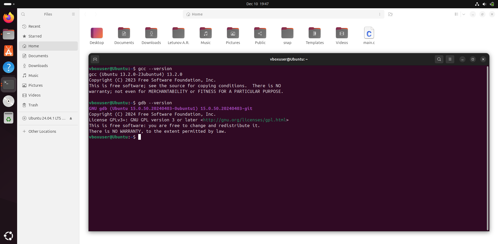
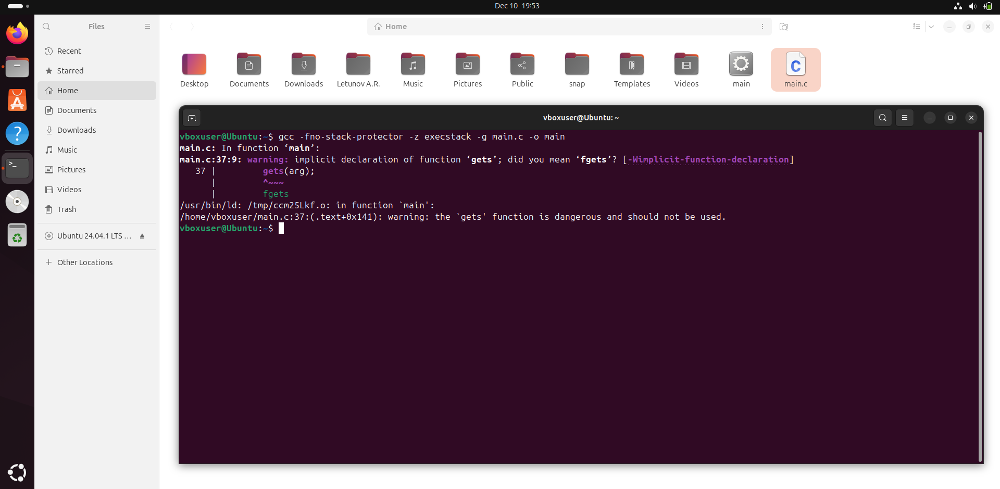
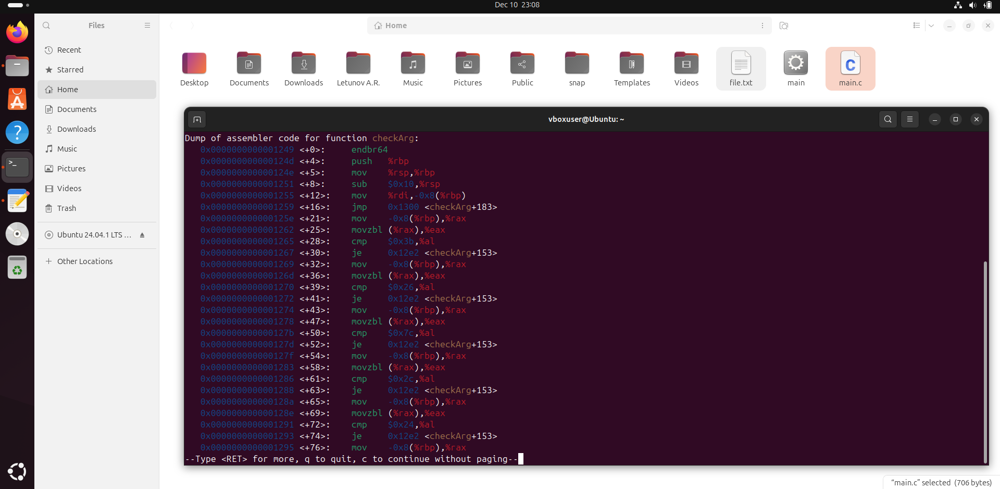
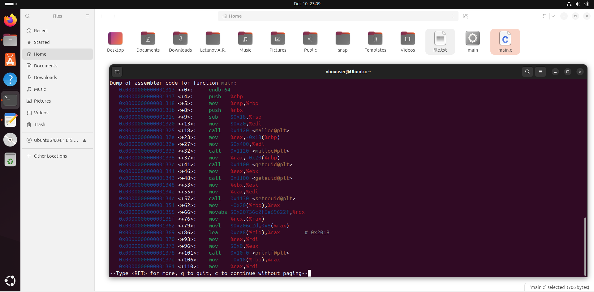
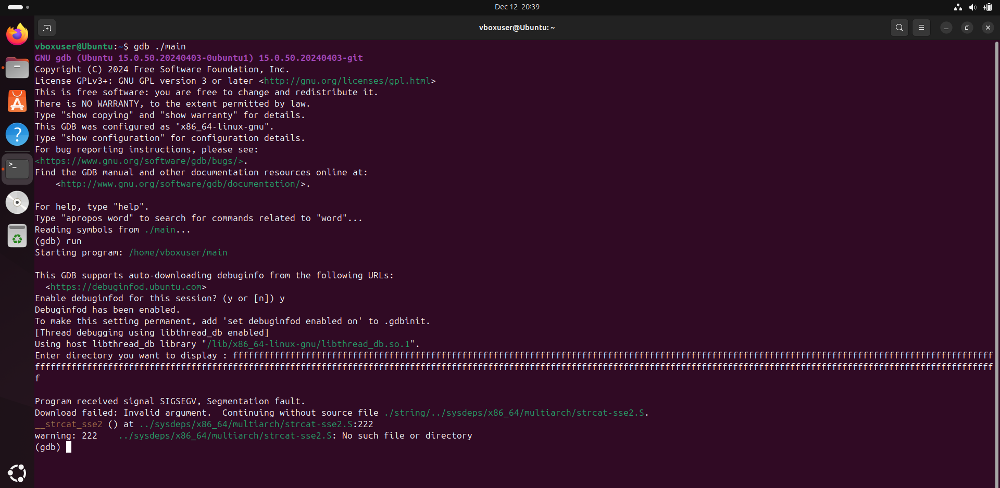
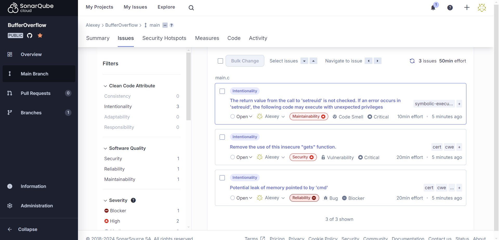
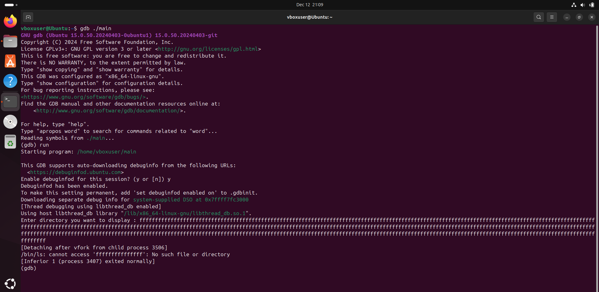

# SDLC_Lab_5
Практика №5 по "Разработке безопасного программного обеспечения"

### 1. Необходимо провести динамическую отладку программного обеспечения с бинарной уязвимостью

Все операции будем проводить в виртуальной машине VirtualBox на операционной системе Ubuntu 64-bit 24.04.1. Для динамической отладки программы будем использовать отладчик gdb, а для компиляции будем использовать gcc.



Код приложения имеет следующий вид.\
**Вариант 4**
```C
#include <stdio.h>
#include <stdlib.h>
#include <string.h>
#include <unistd.h>

void    checkArg(const char \*a)
{
  while (*a)
    {
      if (   (*a == ';')
          || (*a == '&')
          || (*a == '|')
          || (*a == ',')
          || (*a == '$')
          || (*a == '(')
          || (*a == ')')
          || (*a == '{')
          || (*a == '}')
          || (*a == '\`')
          || (*a == '>')
          || (*a == '<') ) {
        puts("Forbidden !!!");
        exit(2);
      }
        a++;
    }
}

int     main()
{
  char  *arg = malloc(0x20);
  char  *cmd = malloc(0x400);
  setreuid(geteuid(), geteuid());

  strcpy(cmd, "/bin/ls -l ");

  printf("Enter directory you want to display : ");

  gets(arg);
  checkArg(arg);

  strcat(cmd, arg);
  system(cmd);

  return 0;
}
```

Эта программа принимает на вход путь к директории и выводит ее содержимое. Причем код обрабатывает пользовательский ввод с помощью функции `checkArg`, что не позволяет пользователю сделать какую-либо инъекцию.

Скомпилируем программу, используя компилятор gcc.



Диассемблируем программу, используя отладчик gdb.




Выполним программу в отладчике и введем большее число символов, чем ожидает буфер для ввода в программе.



Мы можем увидеть бинарную уязвимость или же уязвимость **Buffer Overflow** в программе, которая заключается в том, что код выделяет недостаточно пространства в стеке для получения данных, и в результате стек перезаписывается получаемыми данными, что приводит к ошибке в программе. Однако самая опасная часть этой уязвимости заключается в том, что получаемые данные могут не просто повредить данные программы, а намерено перезаписать определенные участки стека. Так, например, злоумышленник может перезаписать адрес возврата стека, положив туда адрес нужной ему функции, и программа, когда выполнит свою функцию и обратится к перезаписанному адресу возврата, передаст управление программой функции злоумышленника.

### 2. Проанализировать код и сделать кодревью, указав слабые места.

Проанализируем код и укажем в комментариях слабые места. Для более точного нахождения слабых мест воспользуемся статическим анализатором SonarCloud.



```C
#include <stdio.h>
#include <stdlib.h>
#include <string.h>
#include <unistd.h>

void    checkArg(const char *a)
{
  while (*a)
    {
      if (   (*a == ';')
          || (*a == '&')
          || (*a == '|')
          || (*a == ',')
          || (*a == '$')
          || (*a == '(')
          || (*a == ')')
          || (*a == '{')
          || (*a == '}')
          || (*a == '`')
          || (*a == '>')
          || (*a == '<') ) {
        puts("Forbidden !!!");
        exit(2);
      }
        a++;
    }
}

int     main()
{
  char  *arg = malloc(0x20);
  //C и C++ не возвращают автоматически неиспользуемую память. Разработчик должен освободить память, затребованную для его приложения, которая больше не нужна. 
  //В отличие от стека, который автоматически выделяет локальные переменные при вызове функции и освобождает их при возврате функции, куча не предлагает автоматического 
  //управления памятью. Разработчик должен убедиться, что освобождает память, которую он выделяет динамически в куче.
  char  *cmd = malloc(0x400);
  //Функции из семейства setuid, включая setuid и setgid, используются для изменения идентификатора вызывающего процесса. 
  //Они используются для изменения привилегий для последующих действий, которые должны быть выполнены. Если вызов этих функций возвращает ошибку, 
  //которая не проверяется и не обрабатывается должным образом, последующие части программы будут выполнены с неожиданными привилегиями. Это, в свою очередь, 
  //приводит к неожиданному поведению программы и представляет серьезную угрозу безопасности.
  setreuid(geteuid(), geteuid());

  //Использование функции strcpy считается небезопасным, так как она не отслеживает размер своего буфера и ведет к уязвимости buffer overflow
  strcpy(cmd, "/bin/ls -l ");

  printf("Enter directory you want to display : ");

  //Использование функции gets считается небезопасным, так как она не отслеживает размер своего буфера и ведет к уязвимости buffer overflow
  gets(arg);
  checkArg(arg);

  //Функция strcat так же не отслеживает размер своего буфера и ведет к уязвимости buffer overflow
  strcat(cmd, arg);
  system(cmd);

  return 0;
}
```

### 3. Предложить исправление для кода с целью избежать ошибки

Предложим исправления кода с целью избежания уязвимости **Buffer Overflow**. В исправленном коде вместо функции `gets` будем использовать функцию `fgets`, а вместо функций `strcat` и `strcpy` будем использовать `strncat` и `strncpy` соответственно. Данные функции отличаются тем, что принимают параметр, который ограничивает количество символов, которые будут получены в результате ввода данных. Таким образом, сколько бы пользователь не ввел символов, программа считает только первые n символов.

Исправленный код будет выглядеть следующим образом.

```C
#include <stdio.h>
#include <stdlib.h>
#include <string.h>
#include <unistd.h>

void    checkArg(const char *a)
{
  while (*a)
    {
      if (   (*a == ';')
          || (*a == '&')
          || (*a == '|')
          || (*a == ',')
          || (*a == '$')
          || (*a == '(')
          || (*a == ')')
          || (*a == '{')
          || (*a == '}')
          || (*a == '`')
          || (*a == '>')
          || (*a == '<') ) {
        puts("Forbidden !!!");
        exit(2);
      }
        a++;
    }
}

int     main()
{
  int bufferSize = 16;
  int maxCopyAndCatSize = 100;
  char  *arg = malloc(0x20);
  char  *cmd = malloc(0x400);
  setreuid(geteuid(), geteuid());

  strncpy(cmd, "/bin/ls -l ", maxCopyAncCatSize);

  printf("Enter directory you want to display : ");

  fgets(arg, bufferSize, stdin);
  checkArg(arg);

  strncat(cmd, arg, maxCopyAncCatSize);
  system(cmd);

  return 0;
}
```

Скомпилируем исправленный код и попытаемся проэксплуатировать бинарную уязвимость переполнения буффера. 



Таким образом, можно увидеть, что программа считала только первые 16 символов, а остальные отбросила, избежав переполнения буффера.

